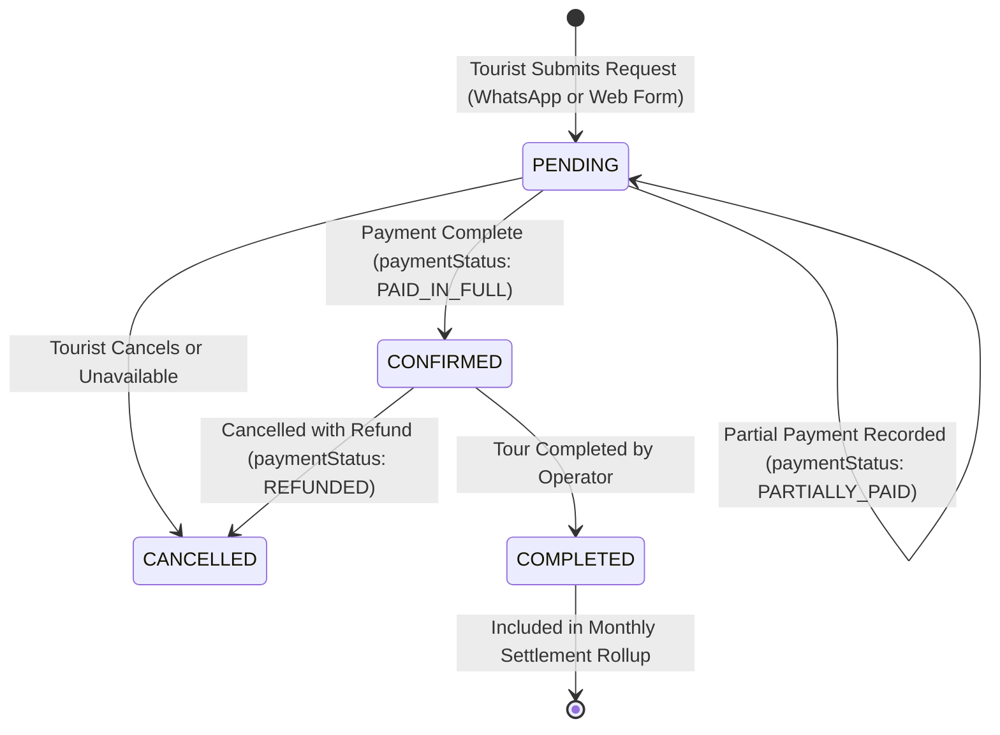

# Tour Booking & Revenue Settlement System

This skill defines the business logic, state machines, and financial accounting rules for Ibrahim Tours Zanzibar (v3.0).

---

## 1. Booking State Machine & Gating Rules



### The Invariant Gate
> **CRITICAL RULE**: A `Booking` record can **NEVER** have `status = CONFIRMED` unless `paymentStatus = PAID_IN_FULL`.

```typescript
// src/lib/services/booking-service.ts
import { BookingStatus, PaymentStatus } from '@prisma/client';

export function assertConfirmationAllowed(status: BookingStatus, paymentStatus: PaymentStatus) {
  if (status === BookingStatus.CONFIRMED && paymentStatus !== PaymentStatus.PAID_IN_FULL) {
    throw new Error(
      `Violation of Booking Invariant: Booking cannot be CONFIRMED when paymentStatus is ${paymentStatus}. Must be PAID_IN_FULL.`
    );
  }
}
```

---

## 2. Payment Recording Architecture

The platform acts as a booking management and payment recording ledger — **it does not process direct payments**. All payments occur off-platform (Cash in USD/EUR/GBP/TZS, Vodacom M-Pesa, Bank Transfer).

### Recording a Payment
When an operator or admin records a physical/mobile payment:
1. Update `amountPaidCents`.
2. Evaluate `paymentStatus`:
   - If `amountPaidCents >= totalPriceCents` -> `PAID_IN_FULL`.
   - If `amountPaidCents > 0` and `< totalPriceCents` -> `PARTIALLY_PAID`.
   - If `0` -> `PENDING`.
3. Auto-calculate `profitCents`:
   $$\text{profitCents} = \text{totalPriceCents} - \text{costCents}$$
4. Auto-calculate `commissionAmountCents`:
   $$\text{commissionAmountCents} = \text{profitCents} \times \text{effectiveCommissionRate}$$
5. Record an entry in `AuditLog`.

---

## 3. Financial Settlement Engine (Monthly Rollup)

At the close of each calendar month, platform administration calculates operator commission dues.

### Settlement Math
For each operator in a given month `YYYY-MM`:
1. Find all bookings where:
   - `operatorId = operator.id`
   - `status = COMPLETED`
   - `paymentStatus = PAID_IN_FULL`
   - `bookingDate` is within target month.
2. Aggregate:
   - `totalBookings = count(bookings)`
   - `totalRevenueCents = sum(totalPriceCents)`
   - `totalProfitCents = sum(profitCents)`
3. Resolve commission rate:
   - Use `operator.commissionRate` if defined; otherwise fallback to `Settings.commission_rate`.
4. Calculate commission due:
   $$\text{commissionDueCents} = \text{totalProfitCents} \times \text{commissionRate}$$
5. Upsert into `MonthlySettlement`:
   ```typescript
   await prisma.monthlySettlement.upsert({
     where: {
       operatorId_month: {
         operatorId: operator.id,
         month: '2026-08',
       },
     },
     update: { totalBookings, totalRevenueCents, totalProfitCents, commissionDueCents },
     create: {
       operatorId: operator.id,
       month: '2026-08',
       totalBookings,
       totalRevenueCents,
       totalProfitCents,
       commissionRate,
       commissionDueCents,
       status: 'PENDING',
     },
   });
   ```

---

## 4. TRA Licensing Compliance

The Zanzibar Revenue Authority (TRA) and Zanzibar Commission for Tourism (ZCT) require licensed commercial tourism operators.
- `traLicenseNumber`: Official license identifier (e.g. `TRA-ZNZ-2024-8841`).
- `traLicenseExpiry`: Expiry timestamp.
- System alert triggers: Warn administration when `traLicenseExpiry < now() + 30 days`.
